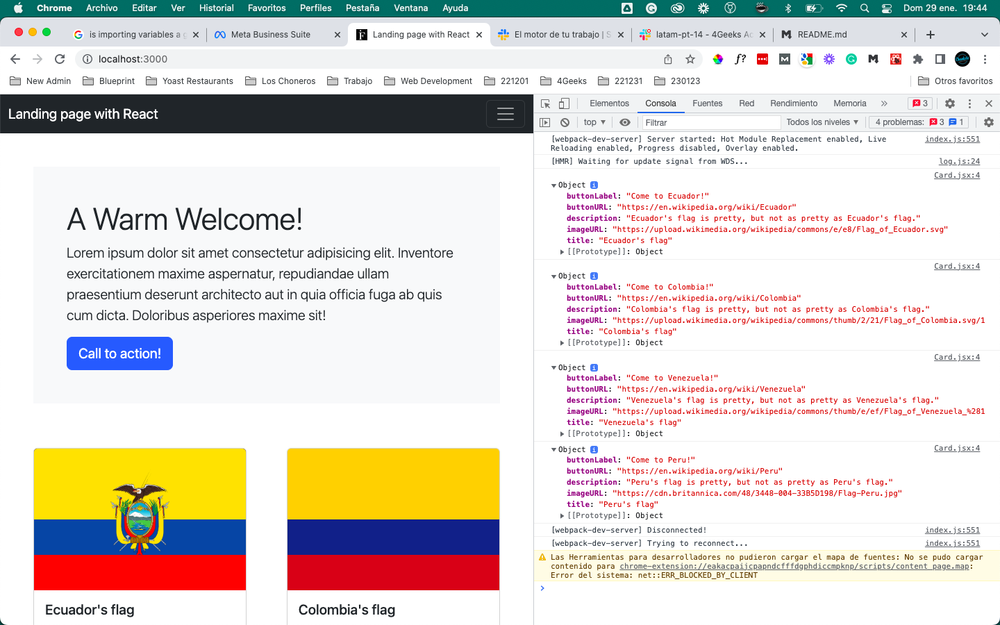

# Landing page with React (_aka_ Understanding how to build with `<Components />` and `props`)

## The structure of the resulting project

```
landing-page-with-react
├─ docs
├─ src
│  ├─ img
│  │  └— cardDataObject.js
│  ├─ js
│  │  ├─ component
│  │  │   ├─ big-chunks
│  │  │   │    ├─ Footer.jsx
│  │  │   │    ├─ Header.jsx
│  │  │   │    └— Main.jsx
│  │  │   ├─ data
│  │  │   │    └— cardDataObject.js
│  │  │   ├─ home
│  │  │   │    └— Home.jsx
│  │  │   └─ small-chunks
│  │  │       ├─ Card.jsx
│  │  │       └— Jumbotron.jsx
│  │  └— index.js
│  └─ styles
└─ store
   ├─ js
   ├─ md
   └─ svg
```

## The recipe of success

1.  For starters, let's take a look at index.js, which is the **entry point** of our project:

        import React from "react";                          //  Imports React
        import ReactDOM from "react-dom";                   //  Imports ReactDOM module
        import "../styles/index.css";                       //  Imports a global stylesheet
        import Home from "../js/component/home/Home.jsx";   //  Imports the only component that is gonna be rendered (Home)
        import "bootstrap/dist/css/bootstrap.min.css";      //  Imports Bootstrap

        ReactDOM.render(<Home />,                           //  Renders the component <Home /> (the WHAT)
        document.querySelector("#app"));                        within the <div> id-ed with "app" (the WHERE).

2.  Let's go to `../js/component/home/Home.jsx`. There, we will see:

        import React from "react";                          //  Imports React
        import Header from "../big-chunks/Header.jsx";      //  Imports Component <Header />
        import Main from "../big-chunks/Main.jsx";          //  Imports Component <Main />
        import Footer from "../big-chunks/Footer.jsx";      //  Imports Component <Footer />

        const Home = () => {                                //  Declares a Component (function that returns HTML code) using an anonymous arrow
                                                                function by the name of Home...
            return (                                        //  ... that returns a block of code...
                <>                                          //  ... starting with a fragment since the Component returns siblings
                    <Header />                              //  ... by calling the Component <Header />...
                    <Main />                                //  ... the Component <Main />...
                    <Footer />                              //  ... and the component <Footer/>
                </>                                         //  The fragment closes.
            );                                              //  The return statement closes.
        };                                                  //  The component closes.

        export default Home;                                //  The component is exported

3.  So far, `index.js` is calling `<Home />` from `Home.jsx`, which is calling:

    1. `<Header/ >` from `Header.jsx`
    2. `<Main/ >` from `Main.jsx`
    3. `<Footer/ >` from `Footer.jsx`

4.  Now, we can take a look at each one of those files:

    1.  `Header.jsx` looks like so:

            import React from "react";                                                          //  Imports React

            const Header = () => {                                                              //  Declaration of the Component as an
                                                                                                    anonymous arrow function ...
                return (                                                                        //  that returns a block of code
                    <header>                                                                    //  which, in this case, is hard-coded.
                        <nav className="navbar navbar-expand-lg navbar-dark bg-dark">
                            <div className="container-fluid">
                                <a className="navbar-brand" href="#">
                                    Landing page with React
                                </a>
                                <button
                                    className="navbar-toggler"
                                    type="button"
                                    data-bs-toggle="collapse"
                                    data-bs-target="#my-navbar"
                                    aria-controls="my-navbar"
                                    aria-expanded="false"
                                    aria-label="Toggle navigation"
                                >
                                    <span className="navbar-toggler-icon"></span>
                                </button>

                                <div className="collapse navbar-collapse" id="my-navbar">
                                    <ul className="navbar-nav mb-2 mb-lg-0">
                                        <li className="nav-item">
                                            <a
                                                className="nav-link active"
                                                aria-current="page"
                                                href="#"
                                            >
                                                Home
                                            </a>
                                        </li>
                                        <li className="nav-item">
                                            <a className="nav-link" href="#">
                                                About
                                            </a>
                                        </li>
                                        <li className="nav-item dropdown">
                                            <a
                                                className="nav-link dropdown-toggle"
                                                href="#"
                                                id="navbarDropdown"
                                                role="button"
                                                data-bs-toggle="dropdown"
                                                aria-expanded="false"
                                            >
                                                Services
                                            </a>
                                            <ul
                                                className="dropdown-menu"
                                                aria-labelledby="navbarDropdown"
                                            >
                                                <li>
                                                    <a className="dropdown-item" href="#">
                                                        Service 1
                                                    </a>
                                                </li>
                                                <li>
                                                    <a className="dropdown-item" href="#">
                                                        Service 2
                                                    </a>
                                                </li>
                                                <li>
                                                    <hr className="dropdown-divider" />
                                                </li>
                                                <li>
                                                    <a className="dropdown-item" href="#">
                                                        See more services
                                                    </a>
                                                </li>
                                            </ul>
                                        </li>
                                        <li className="nav-item">
                                            <a className="nav-link" href="#" tabIndex="-1">
                                                Contact
                                            </a>
                                        </li>
                                    </ul>
                                </div>
                            </div>
                        </nav>
                    </header>
                );
            };

            export default Header;                                                              //  Exports the component <Header />

    2.  `Main.jsx` looks like so:

            import React from "react";                                                          //  Imports React
            import cardDataObject from "../data/cardDataObject";                                //  Imports a .js file (thus, no extension is
                                                                                                    required). In this file we have a set of
                                                                                                    data in the form of object.
            import Card from "../small-chunks/Card.jsx";                                        //  Imports Component Card from file Card.jsx
            import Jumbotron from "../small-chunks/Jumbotron.jsx";                              //  Imports Component Jumbotron from file
                                                                                                    Jumbotron.jsx

            const Main = () => {                                                                //  Declares a Component by the name of Main
                return (                                                                        //  that returns
                    <main>                                                                      //  a block of code which immediately
                        <Jumbotron />                                                           //  calls for the Component Jumbotron
                        <section className="m-5 d-flex flex-wrap justify-content-between">      //  followed by another portion of code where
                            <Card                                                               //  the component Card is called
                                imageURL={cardDataObject.card1.cardImage}                       //  with dynamic properties
                                title={cardDataObject.card1.cardTitle}
                                description={cardDataObject.card1.cardDescription}
                                buttonURL={cardDataObject.card1.cardButton.buttonURL}
                                buttonLabel={cardDataObject.card1.cardButton.buttonLabel}
                            />
                            <Card                                                               //  up to a total
                                imageURL={cardDataObject.card2.cardImage}
                                title={cardDataObject.card2.cardTitle}
                                description={cardDataObject.card2.cardDescription}
                                buttonURL={cardDataObject.card2.cardButton.buttonURL}
                                buttonLabel={cardDataObject.card2.cardButton.buttonLabel}
                            />
                            <Card                                                               //  of four
                                imageURL={cardDataObject.card3.cardImage}
                                title={cardDataObject.card3.cardTitle}
                                description={cardDataObject.card3.cardDescription}
                                buttonURL={cardDataObject.card3.cardButton.buttonURL}
                                buttonLabel={cardDataObject.card3.cardButton.buttonLabel}
                            />
                            <Card                                                               //  times
                                imageURL={cardDataObject.card4.cardImage}
                                title={cardDataObject.card4.cardTitle}
                                description={cardDataObject.card4.cardDescription}
                                buttonURL={cardDataObject.card4.cardButton.buttonURL}
                                buttonLabel={cardDataObject.card4.cardButton.buttonLabel}
                            />
                        </section>                                                              //  And...
                    </main>                                                                     //  ... everything ...
                );                                                                              //  ... closes up...
            };                                                                                  //  ... properly.

            export default Main;                                                                // Component "<Main />" is exported

> **Note**: We aren't taking a look at `Footer.jsx` as it should be already very easy to interpret.

5.  **And what about all of those _dynamic properties_!?**

Components can be called with these **dynamic properties** as if they were somewhat _regular_ HTML attributes.

This is, in the same fashion that, for instance, the tag `<a>`has `href` as an attibute, a Component may be called with _any property_ —with any name— that we want to add.

In this case, our Component `<Card />` has five properties:

-   imageURL
-   title
-   description
-   buttonURL
-   buttonLabel

> Note how the choice of the names of these properties are absolutely arbitrary.

### Hard-coded properties vs dynamic properties

1.  The values of those properties can be hard-coded like so:

    imageURL="https://wherever.i.can/find/the/picture/i-want-to-display"
    title="Whichever Title I Want to Display"
    description="Whichever Description I Want to Display
    buttonURL="https://wherever.i.want/this/button/to/link-to
    buttonLabel="Whatever I want my button label to be"

2.  Or they can be dynamicalled assigned, just as we've seen in the code shown before. Here it is, for our convenience:

        <Card
            imageURL={cardDataObject.card4.cardImage}
            title={cardDataObject.card4.cardTitle}
            description={cardDataObject.card4.cardDescription}
            buttonURL={cardDataObject.card4.cardButton.buttonURL}
            buttonLabel={cardDataObject.card4.cardButton.buttonLabel}
        />

---

#### Breakdown!

-   Properties: `imageURL`, `title`, `description`, `buttonURL`, `buttonLabel`.

-   Values: whatever goes among curly braces, respectively.

---

Now, in this case we've made things a tad harder by calling the values of the properties of our Component `Card` from the data that we have stored in `../data/cardDataObject` in the form of an object called `cardDataObject`.

OK, so... so far:

> We call the **Component** with _arbitrarily named_ **properties** which have a value that can be either hard-coded or dynamically assigned, but... how does the machine knows where to fit those **properties** (`imageURL`, `title`, `description`, `buttonURL`, `buttonLabel`)?

For that, we got to keep digging down the structure of our project.

Remember that, so far, we've moved:

1. From `index.js` - our application's entry point - to `Home.jsx` chasing the Component `Home`.

2. From `Home.jsx` - where we've dissected the Component `Home` - to `Header.jsx`, `Main.jsx`, and `Footer.jsx`.

3. In `Main.jsx`, two Components were called —`<Jumbotron/>` and `<Card />`.

Now:

4.  If we take a look at `Jumbotron.jsx`, we will realize that there are no other components called within, just HTML code —and that there is no dynamic calling of any value at all.

5.  But if we go down to `Card.jsx`, this is what we will see:

        import React from "react";

        const Card = (props) => {
            return (
                <div className="card mt-md-3 my-card">
                    
                    <div className="card-body">
                        <h5 className="card-title">{props.title}</h5>
                        <p className="card-text">{props.description}</p>
                        <a href={props.buttonURL} className="btn btn-primary">
                            {props.buttonLabel}
                        </a>
                    </div>
                </div>
            );
        };

        export default Card;

Let's take this Component - and the `` tag - to properly explain **`props`**.

### Welcome to the world of `props`

Once again, in our `Card.jsx` we find:

        import React from "react";                                              //  Import React

        const Card = (props) => {                                               //  Declare the arrow function Card and pass along the
                                                                                    parameter "props"

Remember that **`props`** is an object. As such, it is composed by pairs of key-value properties. In this case, **`props`** is built like so:

-   A property generated when **declaring** the Component:

                                                                              //  Tag closing

-   A value for each property that is assigned when **calling** the Component (remember that the calling of Component card is happening in `Main.jsx`)

The most obvious way to check out the construction of this `props` object is by using

    console.log(props)

called at the very beginning of the declaration of our Component. In our case, it could be something like:

    const Card = (props) => {
        console.log(props)
        return (
            ...
        );
    };



In the image above, we can see how, certainly, 4 objects have been generated, one for each time the component `<Card />` has been called.

The value of each property of each object formed each time that the Component `<Card />` is called comes from the `cardDataObject.js`. For instance, in the case of the first calling of the Component `<Card />`, the value of each property comes from:

    const cardDataObject = {
        card1: {
            cardImage:
                "https://upload.wikimedia.org/wikipedia/commons/e/e8/Flag_of_Ecuador.svg",
            cardTitle: "Ecuador's flag",
            cardDescription:
                "Ecuador's flag is pretty, but not as pretty as Ecuador's flag.",
            cardButton: {
                buttonLabel: "Come to Ecuador!",
                buttonURL: "https://en.wikipedia.org/wiki/Ecuador",
            },
        },
        ...
    };

Resulting in the following `props` object:

    props = {
        buttonLabel: "Come to Ecuador!",
        buttonURL: "https://en.wikipedia.org/wiki/Ecuador",
        description: "Ecuador's flag is pretty, but not as pretty as Ecuador's flag.",
        imageURL: "https://upload.wikimedia.org/wikipedia/commons/e/e8/Flag_of_Ecuador.svg",
        title: "Ecuador's flag"
    }

And, by doing so, not only our **Landing Page with React** is built, but also the **Bootstrap Cards** within the `<section>` of our `<Main />` Component are generated assigning **dynamic values** to each one of them.

<div style="text-align:center; font-weight:bold"> ~ The End ~</div>
